# Дипломная работа 

### Задача

Ключевая задача — разработать отказоустойчивую инфраструктуру для сайта, включающую мониторинг, сбор логов и резервное копирование основных данных. Инфраструктура должна размещаться в Yandex Cloud и отвечать минимальным стандартам безопасности: запрещается выкладывать токен от облака в git.

### Инфраструктура

Для развёртки инфраструктуры используйте Terraform и Ansible.

Не используйте для ansible inventory ip-адреса! Вместо этого используйте fqdn имена виртуальных машин в зоне ".ru-central1.internal". Пример: example.ru-central1.internal - для этого достаточно при создании ВМ указать name=example, hostname=examle !!

Важно: используйте по-возможности минимальные конфигурации ВМ:2 ядра 20% Intel ice lake, 2-4Гб памяти, 10hdd, прерываемая.

Так как прерываемая ВМ проработает не больше 24ч, перед сдачей работы на проверку дипломному руководителю сделайте ваши ВМ постоянно работающими.

Ознакомьтесь со всеми пунктами из этой секции, не беритесь сразу выполнять задание, не дочитав до конца. Пункты взаимосвязаны и могут влиять друг на друга.

### Сайт
Создайте две ВМ в разных зонах, установите на них сервер nginx, если его там нет. ОС и содержимое ВМ должно быть идентичным, это будут наши веб-сервера.

Используйте набор статичных файлов для сайта. Можно переиспользовать сайт из домашнего задания.

Создайте Target Group, включите в неё две созданных ВМ.

Создайте Backend Group, настройте backends на target group, ранее созданную. Настройте healthcheck на корень (/) и порт 80, протокол HTTP.

Создайте HTTP router. Путь укажите — /, backend group — созданную ранее.

Создайте Application load balancer для распределения трафика на веб-сервера, созданные ранее. Укажите HTTP router, созданный ранее, задайте listener тип auto, порт 80.

Протестируйте сайт curl -v <публичный IP балансера>:80

### Мониторинг
Создайте ВМ, разверните на ней Zabbix. На каждую ВМ установите Zabbix Agent, настройте агенты на отправление метрик в Zabbix.

Настройте дешборды с отображением метрик, минимальный набор — по принципу USE (Utilization, Saturation, Errors) для CPU, RAM, диски, сеть, http запросов к веб-серверам. Добавьте необходимые tresholds на соответствующие графики.

### Логи
Cоздайте ВМ, разверните на ней Elasticsearch. Установите filebeat в ВМ к веб-серверам, настройте на отправку access.log, error.log nginx в Elasticsearch.

Создайте ВМ, разверните на ней Kibana, сконфигурируйте соединение с Elasticsearch.

### Сеть
Разверните один VPC. Сервера web, Elasticsearch поместите в приватные подсети. Сервера Zabbix, Kibana, application load balancer определите в публичную подсеть.

Настройте Security Groups соответствующих сервисов на входящий трафик только к нужным портам.

Настройте ВМ с публичным адресом, в которой будет открыт только один порт — ssh. Эта вм будет реализовывать концепцию bastion host . Синоним "bastion host" - "Jump host". Подключение ansible к серверам web и Elasticsearch через данный bastion host можно сделать с помощью ProxyCommand . Допускается установка и запуск ansible непосредственно на bastion host.(Этот вариант легче в настройке)

### Резервное копирование
Создайте snapshot дисков всех ВМ. Ограничьте время жизни snaphot в неделю. Сами snaphot настройте на ежедневное копирование.

# Выполнение дипломной работы

### Terraform

1. Проверяем установку Terraform: 
```
terraform -v
 ```


2. Вносим данные, указанные в документации 
```
provider_installation {
  network_mirror {
    url = "https://terraform-mirror.yandexcloud.net/"
    include = ["registry.terraform.io/*/*"]
  }
  direct {
    exclude = ["registry.terraform.io/*/*"]
  }
}
 ```
3. В папке, в которой будет запускаться Terraform, создаем файл providers.tf с следующим содежанием
```
terraform {
  required_providers {
    yandex = {
      source  = "yandex-cloud/yandex"
      version = "0.141.0"
    }
  }

  required_version = ">=1.8.4"
}

provider "yandex" {
  # token                    = "do not use!!!"
  cloud_id                 = var.cloud_id
  folder_id                = var.folder_id
  zone = "ru-central1-b"
  service_account_key_file = file("~/.authorized_key.json")
}
 ```
4. Создаем файл c доступом к облак, сервесный аккаунт Yandex Cloud  meta.txt
```
#cloud-config
users:
  - name: user
    groups: sudo
    shell: /bin/bash
    sudo: ['ALL=(ALL) NOPASSWD:ALL']
    ssh-authorized-keys:
      - ssh-ed25519 AAAAC3NzaC1lZDI1NTE5AAAAINPbjPskICzIXWViRi5TXaCtjVDYYr1CZ7puymMG0wxI cozu@cozu-VirtualBox
 ```
5. Инициализация Terraform
```
terraform init
 ```

# Развёртка Terraform
Подготавливаем файлы .tf переменных, инфраструктуры.

Запускаем развертку инфраструктуры в Yandex Cloud
```
terraform apply
 ```


Проверяем созданную инфраструктуру в Yandex Cloud:


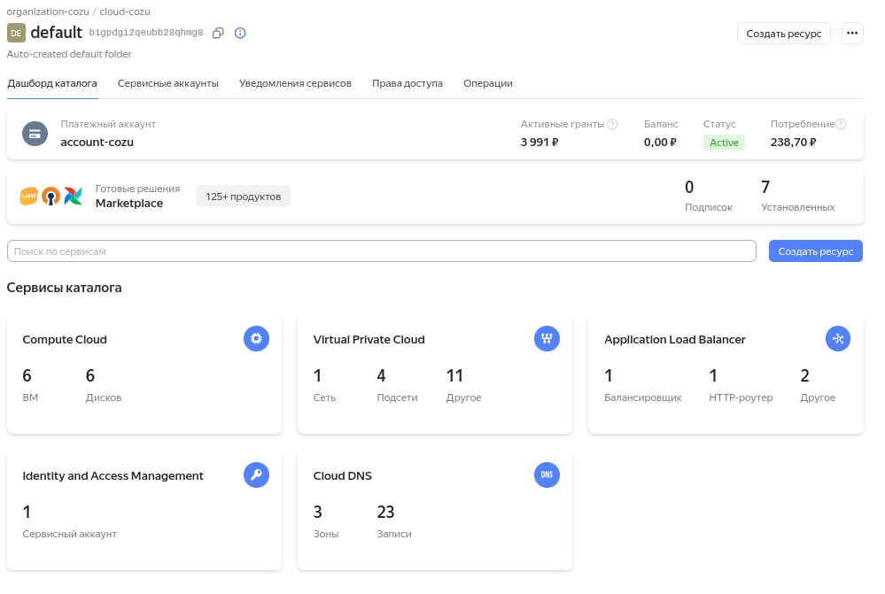
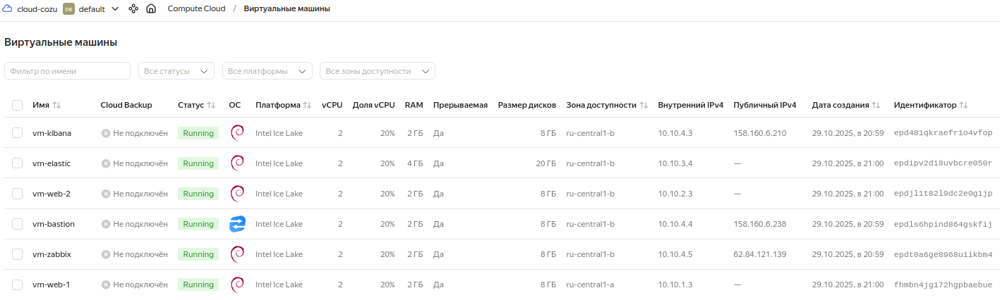
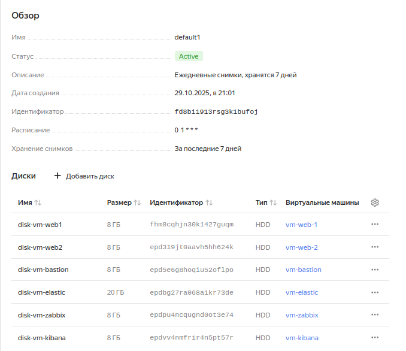


И расписание снимков 

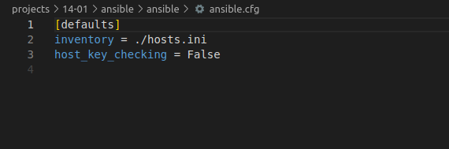

Инфрасруктура развернута, переходим к настройке виртуальных машин

# Ansible

1. Проверяем установку Ansible 
```
ansible --version
 ```
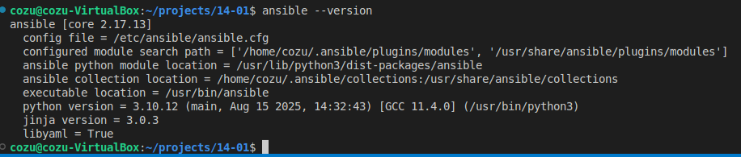

Настраиваем ansible на работу через bastion

файл конфигурации

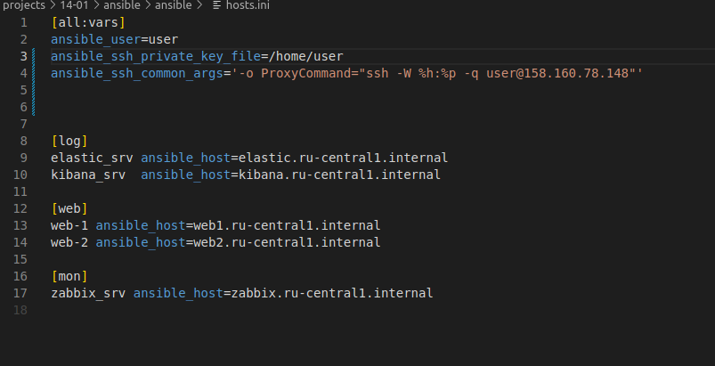

Создаем файл hosts.ini c использованием FQDN имен серверов 

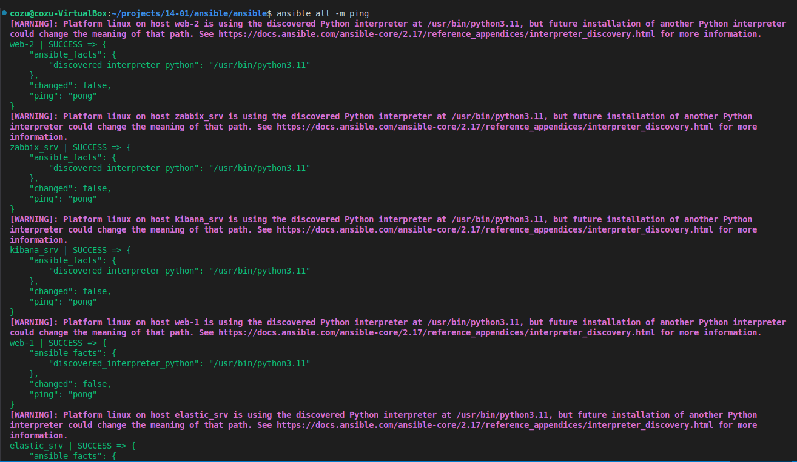

Проверяем доступность ВМ используя модуль ping

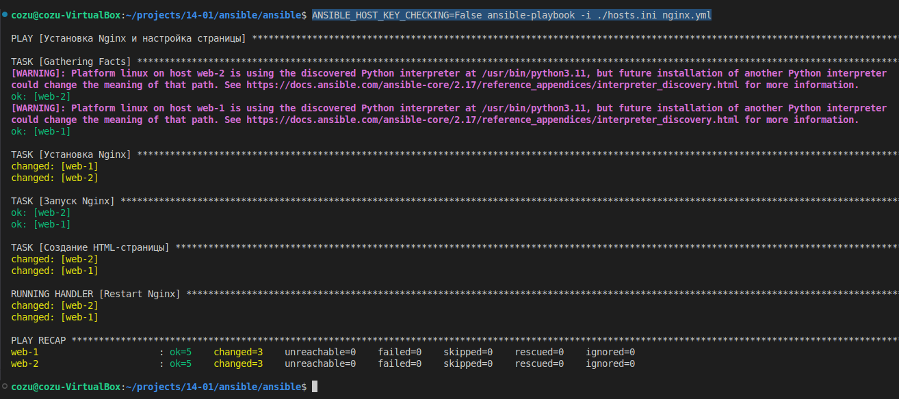

# Устанавливаем NGINX и загружаем сайт

```
ANSIBLE_HOST_KEY_CHECKING=False ansible-playbook -i ./hosts.ini nginx.yml 
 ```


Проверяем доступность сайта в браузере по публичному ip адресу Load Balancer

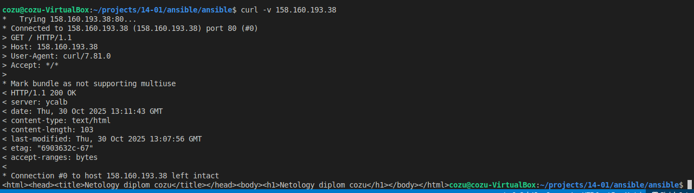

Делаем запрос curl -v 

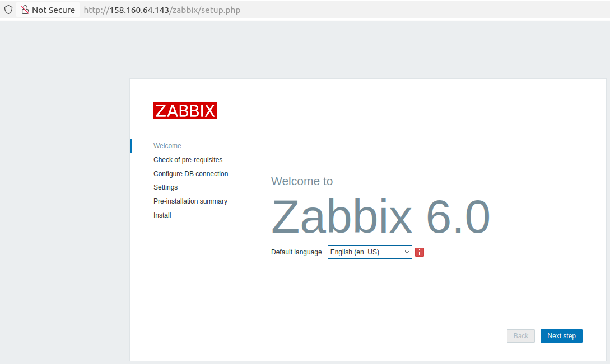

# Мониторинг


Устанавливаем Zabbix сервер
 ```
ANSIBLE_HOST_KEY_CHECKING=False ansible-playbook -i ./hosts.ini zabbix.yml
 ```
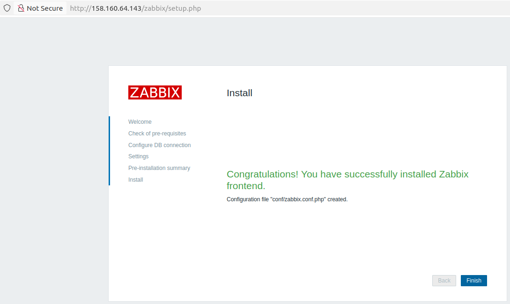

Проверяем что zabbix сервер доступнен 

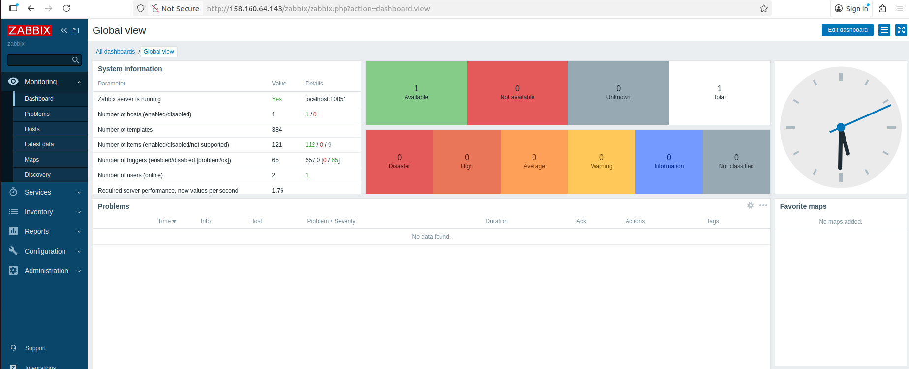

Устанавливаем Zabbix агентов на web сервера
 ```
ANSIBLE_HOST_KEY_CHECKING=False ansible-playbook -i ./hosts.ini zabbix_agent.yml 
 ```
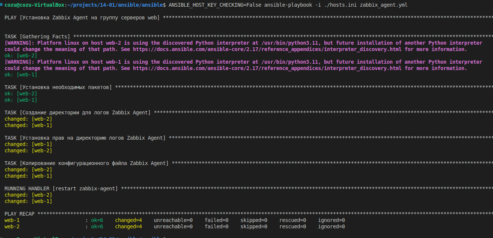

Добавляем хосты используя FQDN имена в zabbix сервер и настраиваем дашборды


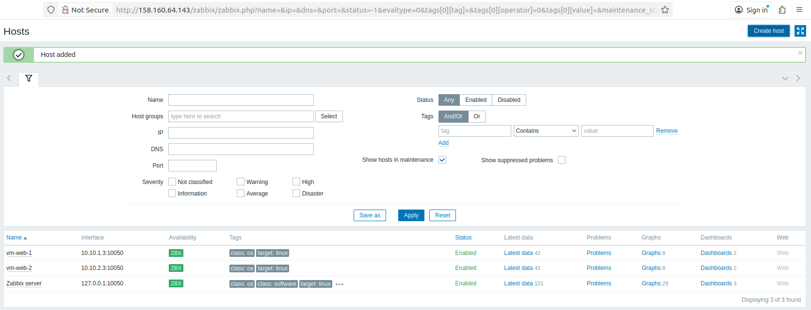
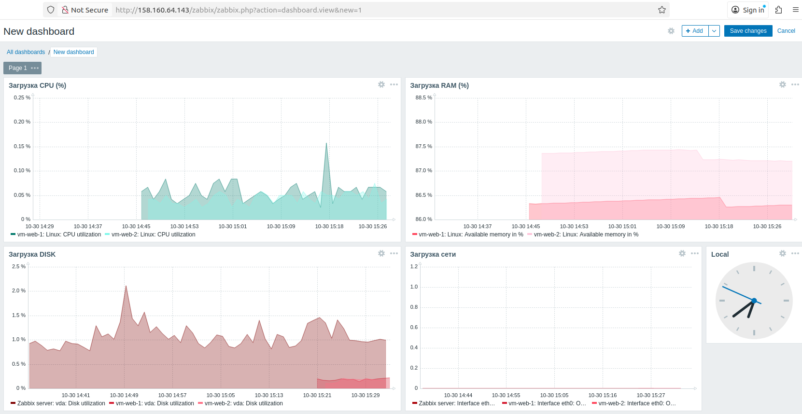
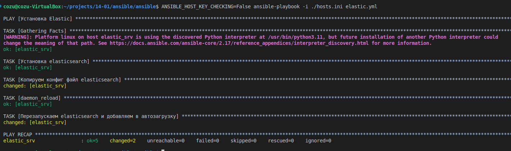
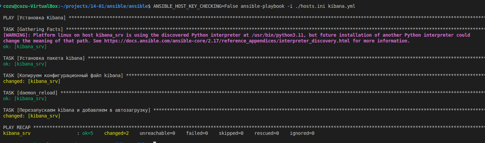


# Устанавлиеваем стек ELK для сбора логов

Установливаем  Elasticsearch
 ```
ANSIBLE_HOST_KEY_CHECKING=False ansible-playbook -i ./hosts.ini elastic.yml 
 ```
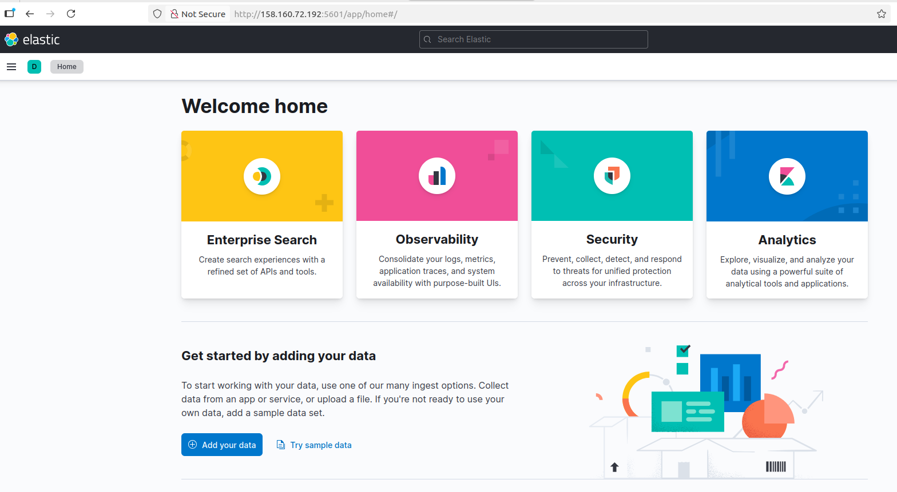

# Устанавливаем Kibana
 ```
ANSIBLE_HOST_KEY_CHECKING=False ansible-playbook -i ./hosts.ini kibana.yml 
 ```
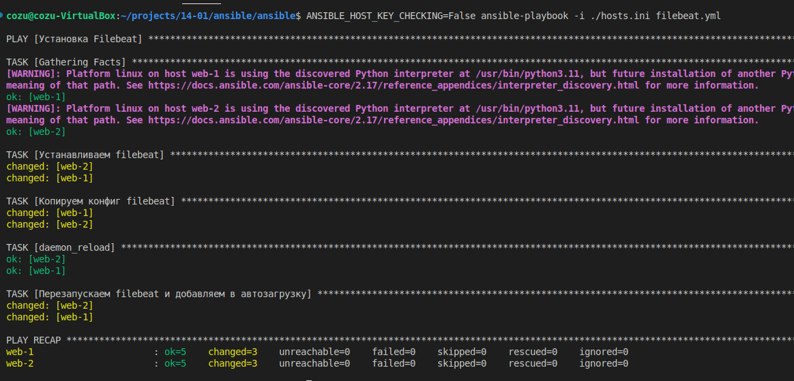

проверяем что Kibana работает


# Устанавливаем Filebeat на web сервера
```
ANSIBLE_HOST_KEY_CHECKING=False ansible-playbook -i ./hosts.ini filebeat.yml 
```
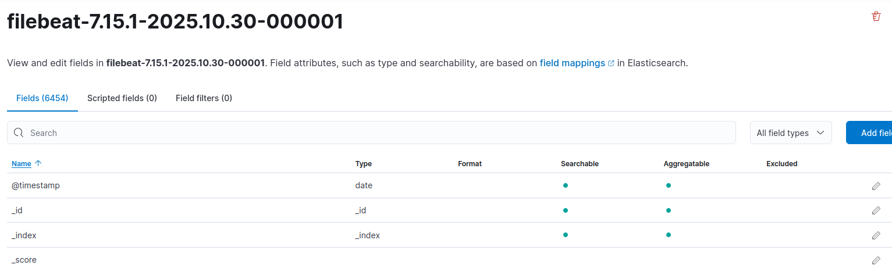

Проверяем в Kibana что Filebeat доставляет логи в Elasticsearch
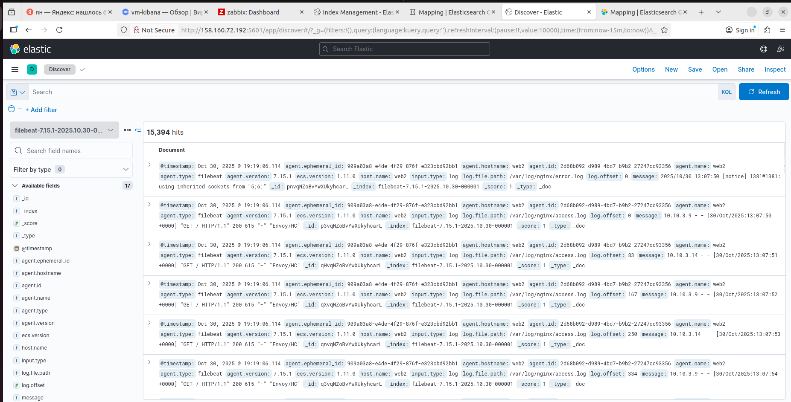


# Балансировщик [Балансировщик](http://84.252.132.245/)
# Zabbix [Логин: Almin Пароль: zabbix](http://158.160.81.219/zabbix/)
# Kibana [Kibana](http://158.160.66.160:5601/app/home#/)

Интерфейс Zabbix готов. Имя пользователя по умолчанию — Admin , пароль — zabbix (http://89.169.160.155/zabbix/)
Балансировщик доступен по адресу (http://158.160.193.38)
Kibana  (http://89.169.179.61:5601/app/home#/)
Посмотреть логи можно тут (http://89.169.179.61:5601/app/discover#/?_g=(filters:!(),query:(language:kuery,query:''),refreshInterval:(pause:!f,value:10000),time:(from:now-15m,to:now))&_a=(columns:!(),filters:!(),index:'9719e900-b5ae-11f0-9ca3-9983c7451ba0',interval:auto,query:(language:kuery,query:''),sort:!()))
